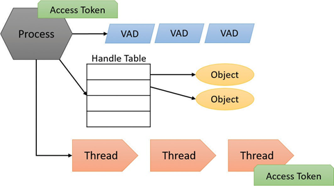

# Потоки

Поток — это сущность внутри процесса, которую Windows планирует для выполнения. Без него программа процесса не может работать. Поток включает следующие основные компоненты:

* Содержимое набора регистров ЦП, представляющее состояние процессора.
* Два стека: один для использования потоком при выполнении в режиме ядра, другой — в пользовательском режиме.
* Личная область хранения, называемая _локальным хранилищем потока_ (TLS), используемая подсистемами, библиотеками времени выполнения и DLL.
* Уникальный идентификатор, называемый _идентификатором потока_ (часть внутренней структуры, называемой _идентификатором клиента_; идентификаторы процессов и идентификаторы потоков генерируются из одного и того же пространства имен, поэтому они никогда не пересекаются).

Кроме того, потоки иногда имеют свой собственный контекст безопасности, или токен, который часто используется многопотоковыми серверными приложениями, которые имитируют контекст безопасности клиентов, которым они служат.&#x20;

Летучие регистры, стеки и личная область хранения называются _контекстом_ потока. Поскольку эта информация различается для каждой архитектуры машины, на которой работает Windows, эта структура по необходимости является архитектурно-специфичной. Функция Windows GetThreadContext обеспечивает доступ к этой архитектурно-специфичной информации (называемой блоком CONTEXT).&#x20;

Поскольку переключение выполнения с одного потока на другой связано с планировщиком ядра, это может быть дорогостоящей операцией, особенно если два потока часто переключаются между собой. Windows реализует два механизма для снижения этой стоимости: _волокна_ и _планирование в пользовательском режиме_ (UMS).

### **Файберы**

Файберы позволяют приложению самостоятельно управлять потоками выполнения вместо того, чтобы полагаться на встроенный в Windows механизм планирования на основе приоритетов. Файберы часто называют _лёгкими потоками_. В плане планирования они невидимы для ядра, так как реализуются в пользовательском режиме в Kernel32.dll. Для использования файберов сначала нужно вызвать функцию ConvertThreadToFiber Windows. Эта функция преобразует поток в работающий файбер. После этого вновь преобразованный файбер может создавать дополнительные файберы с помощью функции CreateFiber. (Каждый файбер может иметь свой собственный набор файберов.) В отличие от потока, файбер не начинает выполнение, пока его вручную не выберут с помощью вызова функции SwitchToFiber. Новый файбер выполняется до тех пор, пока не завершится или не вызовет SwitchToFiber снова, выбирая другой файбер для выполнения. Для получения дополнительной информации смотрите документацию Windows SDK по функциям файберов.

### **Потоки планирования в пользовательском режиме**&#x20;

Потоки планирования в пользовательском режиме (UMS), доступные только в 64-битных версиях Windows, предоставляют те же основные преимущества, что и волокна, и лишь некоторые из их недостатков. Потоки UMS имеют собственное состояние потока ядра и, следовательно, видны ядру, что позволяет нескольким потокам UMS выполнять блокирующие системные вызовы и совместно использовать и бороться за ресурсы. Или, когда два или более потоков UMS должны выполнять работу в пользовательском режиме, они могут периодически переключать контексты исполнения (уступать от одного потока к другому) в пользовательском режиме, не включая планировщик. С точки зрения ядра, тот же поток ядра всё еще выполняется, и ничего не изменилось. Когда поток UMS выполняет операцию, требующую входа в ядро (например, системный вызов), он переключается на свой выделенный поток режима ядра (называемый _направленным переключением контекста_). Хотя потоки UMS по-прежнему не могут одновременно выполняться на нескольких процессорах, они следуют модели вытеснения, которая не исключительно кооперативна.

Хотя у потоков есть собственный контекст выполнения, каждый поток в процессе разделяет виртуальное адресное пространство процесса (в дополнение ко всем остальным ресурсам, принадлежащим процессу), что означает, что все потоки в процессе имеют полный доступ на чтение и запись в виртуальное адресное пространство процесса. Потоки не могут случайно обращаться к адресному пространству другого процесса, однако, если только другой процесс не предоставит часть своего частного адресного пространства в качестве разделяемого участка памяти (в Windows API это называется _объектом отображения файла_) или если один процесс имеет право открыть другой процесс для использования функций межпроцессной памяти, таких как ReadProcessMemory и WriteProcessMemory (что процесс, выполняющийся под той же учётной записью пользователя и не внутри AppContainer или другого типа песочницы, может сделать по умолчанию, если у целевого процесса нет определённых защит).

В дополнение к приватному адресному пространству и одному или нескольким потокам, каждый процесс имеет контекст безопасности и список открытых дескрипторов для объектами ядра, такими как файлы, разделяемые участки памяти или один из объектов синхронизации, таких как мьютексы, события или семафоры, как показано ниже.

<figure><figcaption></figcaption></figure>

Каждый процесс имеет контекст безопасности, который хранится в объекте, называемом _токеном доступа_. Токен доступа процесса содержит идентификацию и учетные данные безопасности для процесса. По умолчанию потоки не имеют собственных токенов доступа, но могут их получать, что позволяет отдельным потокам имитировать контекст безопасности другого процесса — включая процессы на удаленной системе Windows — не затрагивая другие потоки в процессе. (Подробности о безопасности процессов и потоков см. в главе 7.)&#x20;

_Дескрипторы виртуальных адресов_ (_VAD_) — это структуры данных, которые менеджер памяти использует для отслеживания виртуальных адресов, используемых процессом. Эти структуры данных описаны более подробно в главе 5.
